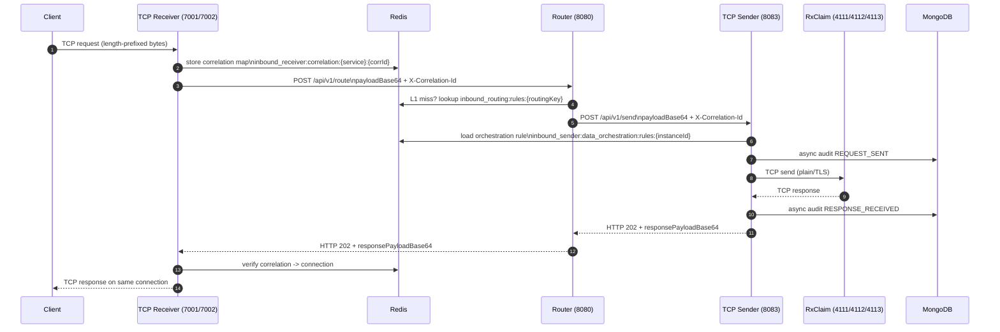

# RxLink Inbound Services (`nbound-service`)

Spring Boot 3 multi-module implementation of the RxLink inbound flow:

`Client -> TCP Receiver (7001/7002) -> Router (HTTP 8080) -> TCP Sender (HTTP 8083 + TCP 4111/4112/4113) -> RxClaim`

This repository implements the receiver, router, and sender services with Redis-based dynamic routing/config, async Mongo audit, correlation propagation, Prometheus metrics, and readiness/liveness probes.

## Modules

| Module | Responsibility |
|---|---|
| `inbound-common` | Shared DTOs used between services (`InboundMessageDto`, route/send response DTOs). |
| `inbound-tcp-receiver` | Accepts inbound TCP requests on deployment port (7001/7002), generates and tracks correlation, forwards to router, returns response to same TCP connection. |
| `inbound-router` | Receives receiver HTTP requests on `POST /api/v1/route`, resolves route using L1/L2 cache, forwards to the right sender instance, returns sender response payload. |
| `inbound-tcp-sender` | Receives router HTTP requests on `POST /api/v1/send`, applies orchestration rules from Redis, sends to RxClaim over TCP, returns response payload and writes async audit. |

## Architecture

1. Client sends framed TCP payload to receiver port (`7001` or `7002`).
2. Receiver creates correlation ID, stores correlation metadata in Redis, forwards payload to router over HTTP with `X-Correlation-Id`.
3. Router derives routing key from message data, resolves destination sender URL (`L1 Caffeine -> L2 Redis`), and forwards request to sender.
4. Sender applies orchestration rules from Redis and sends transformed payload to RxClaim over TCP (`4111/4112/4113` deployment-specific).
5. Sender receives RxClaim response, returns Base64 response to router.
6. Router returns response to receiver.
7. Receiver verifies correlation-to-connection mapping and writes response back to the same TCP client connection.

## Protocol and Payload

### TCP framing

Both inbound and outbound TCP paths use `ByteArrayLengthHeaderSerializer`:
- 4-byte big-endian length prefix
- followed by exact payload bytes

If your client uses MLLP or custom framing, update receiver/sender serializers accordingly.

### HTTP request DTO (`InboundMessageDto`)

```json
{
  "payloadBase64": "BASE64_ENCODED_PAYLOAD",
  "correlationId": "optional-correlation-id",
  "routingKey": "optional-explicit-routing-key",
  "sourceChannel": "RELAY_HEALTH|CHANGE_HEALTH|...",
  "attributes": {
    "k1": "v1"
  }
}
```

## Dynamic Config and Redis Keys

### Router
- Route rules (L2): `inbound_routing:rules:{routingKey}` -> sender base URL
- L1 cache: Caffeine in-process
- Invalidation channel: `rxlink:cache:invalidate`

### Receiver
- Receiver config hash: `inbound_receiver:config:{serviceName}`
  - `routerBaseUrl`
  - `routerConnectTimeoutMs`
  - `routerReadTimeoutMs`
  - `routerRoutePath`
  - `maxConnections`
- Correlation mapping hash: `inbound_receiver:correlation:{serviceName}:{correlationId}`
  - `connectionId`, `status`, `requestBytes`, `detail`
- L1 cache: Caffeine for config/correlation hot entries

### Sender
- Orchestration rules: `inbound_sender:data_orchestration:rules:{instanceId}`
  - JSON shape: `{"prefixBase64":"...","suffixBase64":"..."}`
- Invalidation channel: `rxlink:cache:invalidate`

## Routing Key Resolution (Router)

Priority:
1. Use `routingKey` from request if present.
2. Else parse HL7 `MSH` segment sending application.
3. Else fallback to hash-derived key (`hash:...`).

## Build

```bash
mvn -DskipTests package
```

Artifacts:
- `inbound-router/target/inbound-router-1.0.0-SNAPSHOT.jar`
- `inbound-tcp-receiver/target/inbound-tcp-receiver-1.0.0-SNAPSHOT.jar`
- `inbound-tcp-sender/target/inbound-tcp-sender-1.0.0-SNAPSHOT.jar`

## Local Dependencies

Use bundled compose file:

```bash
docker compose up -d
```

Starts:
- Redis (`6379`)
- Mongo (`27017`)

## Run Locally

Open 3 terminals.

### 1) Router

```bash
java -jar inbound-router/target/inbound-router-1.0.0-SNAPSHOT.jar
```

### 2) Sender (example for 4111)

```bash
INBOUND_SENDER_INSTANCE_ID=sender-4111 \
RXCLAIM_TCP_HOST=localhost \
RXCLAIM_TCP_PORT=4111 \
java -jar inbound-tcp-sender/target/inbound-tcp-sender-1.0.0-SNAPSHOT.jar
```

### 3) Receiver (example for relay on 7001)

```bash
SERVICE_NAME=rxlink-inbound-receiver-7001 \
INBOUND_TCP_PORT=7001 \
INBOUND_SOURCE_CHANNEL=RELAY_HEALTH \
INBOUND_ROUTER_URL=http://localhost:8080 \
java -jar inbound-tcp-receiver/target/inbound-tcp-receiver-1.0.0-SNAPSHOT.jar
```

## Deployment Matrix

### Receiver deployments
- `rxlink-inbound-receiver-7001` -> `INBOUND_TCP_PORT=7001`
- `rxlink-inbound-receiver-7002` -> `INBOUND_TCP_PORT=7002`

### Sender deployments
- `rxlink-inbound-sender-4111` -> `RXCLAIM_TCP_PORT=4111`
- `rxlink-inbound-sender-4112` -> `RXCLAIM_TCP_PORT=4112`
- `rxlink-inbound-sender-4113` -> `RXCLAIM_TCP_PORT=4113`

Same codebase; deployment-specific behavior comes from env/config.

## TLS to RxClaim (Sender)

Set these env vars on sender deployment:

```bash
RXCLAIM_TLS_ENABLED=true
RXCLAIM_TLS_PROTOCOL=TLSv1.2
RXCLAIM_TLS_KEYSTORE_PATH=/secure/path/client-keystore.p12
RXCLAIM_TLS_KEYSTORE_PASSWORD=changeit
RXCLAIM_TLS_KEYSTORE_TYPE=PKCS12
RXCLAIM_TLS_TRUSTSTORE_PATH=/secure/path/truststore.p12
RXCLAIM_TLS_TRUSTSTORE_PASSWORD=changeit
RXCLAIM_TLS_TRUSTSTORE_TYPE=PKCS12
```

When disabled (`false`), sender uses plain TCP.

## Health and Probes

All services expose:
- `/actuator/health`
- `/actuator/prometheus`

Probe support:
- `management.endpoint.health.probes.enabled=true`
- readiness/liveness endpoints available through Actuator health groups in k8s setup

Additional readiness logic:
- Router can optionally check sender reachability.
- Sender can optionally check RxClaim reachability.

## Metrics (Prometheus)

### Receiver
- `receiver_messages_received_total`
- `receiver_router_forward_success_total`
- `receiver_router_forward_failure_total`
- `receiver_tcp_connections_active`
- `receiver_tcp_connection_rejected_total`
- `receiver_tcp_connection_utilization`

### Router
- `router_messages_routed_total`
- `router_messages_failed_total`
- `router_message_latency_seconds`
- `router_routing_cache_hits_total`
- `router_routing_cache_misses_total`

### Sender
- `sender_messages_processed_total`
- `sender_messages_failed_total`
- `sender_rxclaim_latency_seconds`
- `sender_rxclaim_pool_active`
- `sender_rxclaim_pool_idle`
- `sender_rxclaim_pool_allocated`
- `sender_http_connections_active`

## Mongo Audit

### Router
- Configurable via `inbound.router.audit.mongo-enabled` (default `false`).

### Sender
- Async writes for:
  - request sent (`REQUEST_SENT`)
  - response received (`RESPONSE_RECEIVED`)
- Collection: `inbound_send_audit`

## Operational Notes

- Use `rxlink:cache:invalidate` publish to clear L1 caches across pods.
- Keep Redis and Mongo highly available for consistent behavior.
- For secure deployments, inject all secret values via environment/secret manager (do not hardcode credentials).

## Troubleshooting

- **No route found**
  - Verify `inbound_routing:rules:{routingKey}` exists in Redis.
  - Check router fallback `inbound.router.default-target-url`.
- **Receiver forwarding failures**
  - Verify router URL and timeouts in receiver config hash or env.
- **Sender TCP failures**
  - Verify host/port and RxClaim reachability from sender pod.
  - If TLS enabled, verify keystore/truststore paths and passwords.
- **Empty TCP response to client**
  - Check sender response body (`responsePayloadBase64`) and RxClaim behavior.

## Quick Redis Seed Examples

```bash
# Route key to sender-4111
redis-cli SET "inbound_routing:rules:MY_APP" "http://rxlink-inbound-sender-4111:8083"

# Sender orchestration rule
redis-cli SET "inbound_sender:data_orchestration:rules:sender-4111" '{"prefixBase64":"","suffixBase64":""}'

# Receiver runtime config
redis-cli HSET "inbound_receiver:config:rxlink-inbound-receiver-7001" \
  routerBaseUrl "http://rxlink-inbound-router:8080" \
  routerConnectTimeoutMs "5000" \
  routerReadTimeoutMs "120000" \
  routerRoutePath "/api/v1/route" \
  maxConnections "500"
```

## Kubernetes Deployment Guide

This section provides production-style deployment patterns. Keep one Deployment per service flavor and externalize environment-specific values via ConfigMap/Secret.

### Recommended resources

- **Receiver (7001/7002)**: separate Deployments, independent HPA
- **Router (8080)**: stateless Deployment, horizontal scale by CPU and p95 latency
- **Sender (4111/4112/4113)**: separate Deployments per target port, independent HPA

### Example: Router Deployment (snippet)

```yaml
apiVersion: apps/v1
kind: Deployment
metadata:
  name: rxlink-inbound-router
spec:
  replicas: 2
  selector:
    matchLabels:
      app: rxlink-inbound-router
  template:
    metadata:
      labels:
        app: rxlink-inbound-router
    spec:
      containers:
        - name: router
          image: <your-repo>/inbound-router:<tag>
          ports:
            - containerPort: 8080
          env:
            - name: REDIS_HOST
              value: redis
            - name: REDIS_PORT
              value: "6379"
            - name: MONGODB_URI
              valueFrom:
                secretKeyRef:
                  name: inbound-secrets
                  key: mongodb-uri
            - name: INBOUND_DEFAULT_SENDER_URL
              value: "http://rxlink-inbound-sender-4111:8083"
          readinessProbe:
            httpGet:
              path: /actuator/health/readiness
              port: 8080
            initialDelaySeconds: 15
            periodSeconds: 10
          livenessProbe:
            httpGet:
              path: /actuator/health/liveness
              port: 8080
            initialDelaySeconds: 20
            periodSeconds: 15
```

### Example: Receiver Deployment (7001 variant)

```yaml
apiVersion: apps/v1
kind: Deployment
metadata:
  name: rxlink-inbound-receiver-7001
spec:
  replicas: 2
  selector:
    matchLabels:
      app: rxlink-inbound-receiver-7001
  template:
    metadata:
      labels:
        app: rxlink-inbound-receiver-7001
    spec:
      containers:
        - name: receiver
          image: <your-repo>/inbound-tcp-receiver:<tag>
          ports:
            - name: http
              containerPort: 8081
            - name: tcp-in
              containerPort: 7001
          env:
            - name: SERVICE_NAME
              value: rxlink-inbound-receiver-7001
            - name: INBOUND_TCP_PORT
              value: "7001"
            - name: INBOUND_SOURCE_CHANNEL
              value: RELAY_HEALTH
            - name: INBOUND_ROUTER_URL
              value: "http://rxlink-inbound-router:8080"
            - name: REDIS_HOST
              value: redis
            - name: REDIS_PORT
              value: "6379"
          readinessProbe:
            tcpSocket:
              port: tcp-in
            initialDelaySeconds: 15
            periodSeconds: 10
          livenessProbe:
            tcpSocket:
              port: tcp-in
            initialDelaySeconds: 20
            periodSeconds: 15
```

### Example: Sender Deployment (4111 variant with optional TLS)

```yaml
apiVersion: apps/v1
kind: Deployment
metadata:
  name: rxlink-inbound-sender-4111
spec:
  replicas: 2
  selector:
    matchLabels:
      app: rxlink-inbound-sender-4111
  template:
    metadata:
      labels:
        app: rxlink-inbound-sender-4111
    spec:
      containers:
        - name: sender
          image: <your-repo>/inbound-tcp-sender:<tag>
          ports:
            - containerPort: 8083
          env:
            - name: SERVICE_NAME
              value: rxlink-inbound-sender-4111
            - name: INBOUND_SENDER_INSTANCE_ID
              value: sender-4111
            - name: RXCLAIM_TCP_HOST
              value: rxclaim-host
            - name: RXCLAIM_TCP_PORT
              value: "4111"
            - name: RXCLAIM_TLS_ENABLED
              value: "false"
            - name: REDIS_HOST
              value: redis
            - name: REDIS_PORT
              value: "6379"
            - name: MONGODB_URI
              valueFrom:
                secretKeyRef:
                  name: inbound-secrets
                  key: mongodb-uri
          readinessProbe:
            httpGet:
              path: /actuator/health/readiness
              port: 8083
            initialDelaySeconds: 15
            periodSeconds: 10
          livenessProbe:
            httpGet:
              path: /actuator/health/liveness
              port: 8083
            initialDelaySeconds: 20
            periodSeconds: 15
```

### ConfigMap / Secret split recommendation

- **ConfigMap**: non-secret envs (ports, hostnames, feature toggles, pool sizes)
- **Secret**: Mongo URI, TLS keystore/truststore passwords, any credentials

### Service exposure recommendation

- Receiver: `ClusterIP` + internal/external TCP exposure as required by network design
- Router: `ClusterIP` (internal HTTP)
- Sender: `ClusterIP` (internal HTTP), outbound only to RxClaim TCP

## Mermaid Sequence Diagram


